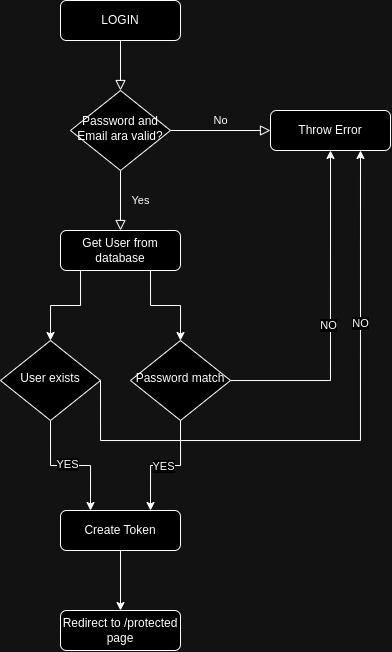

# PlayAward task


## How to run project

Set the environment variables:

```bash
cp .env.example .env

# open .env and modify the environment variables (if needed)
```
With Docker type next command in terminal:
```bash
docker-compose build && docker-compose up
```

Without Docker run next steps:
```bash
npm install
```

```bash
npm start
```

For Swagger Documentation go to this URL:
```
http://localhost:3000/v1/docs
```

## API's

### USER REGISTER

To Register new User go to this URL:
```
http://localhost:3000/register
```

To help you understand how register works you can check out this diagram:


### LOGIN USER


To Login with existing user go to this URL:
```
http://localhost:3000/login
```

To help you understand how login works you can check out this diagram:



### RESET USER PASSWORD

To reset your password go to this URL:
```
http://localhost:3000/forgot-password
```

To help you understand how to reset password you can check out this diagram:


## Table of Contents

- [Commands](#commands)
- [Linting](#linting)
- [Logging](#logging)


## Commands

Running project locally:

```bash
npm run start:dev
```

Running project with Docker:

```bash
docker-compose build && docker-compose up
```


## Linting

Linting is done using [ESLint](https://eslint.org/) and [Prettier](https://prettier.io).

To prevent a certain file or directory from being linted, add it to `.eslintignore` and `.prettierignore`.

## Logging

Import the logger from `src/config/logger.js`. It is using the [Winston](https://github.com/winstonjs/winston) logging library.

Logging should be done according to the following severity levels (ascending order from most important to least important):

```javascript
const logger = require('<path to src>/config/logger');

logger.error('message'); // level 0
logger.warn('message'); // level 1
logger.info('message'); // level 2
logger.http('message'); // level 3
logger.verbose('message'); // level 4
logger.debug('message'); // level 5
```

Note: API request information (request url, response code, timestamp, etc.) are also automatically logged (using [morgan](https://github.com/expressjs/morgan)).
